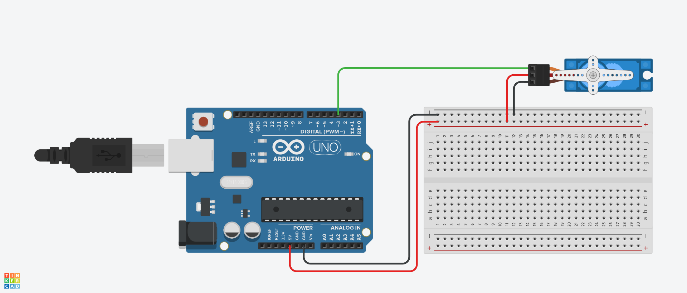
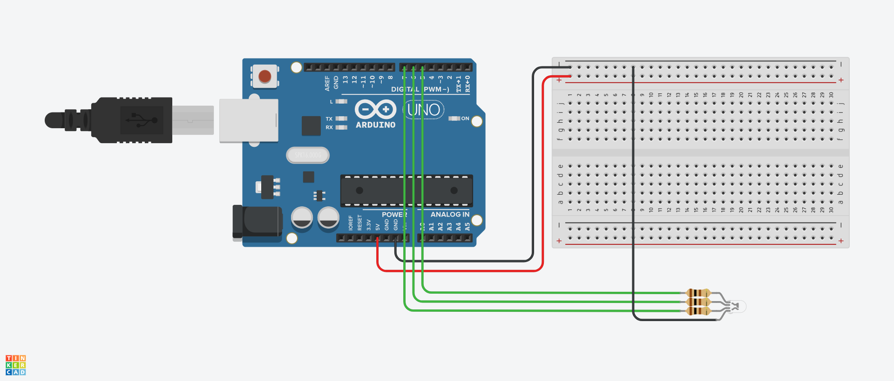
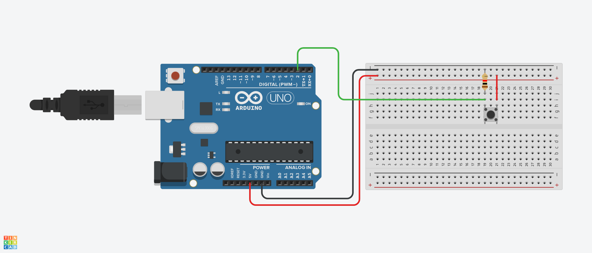
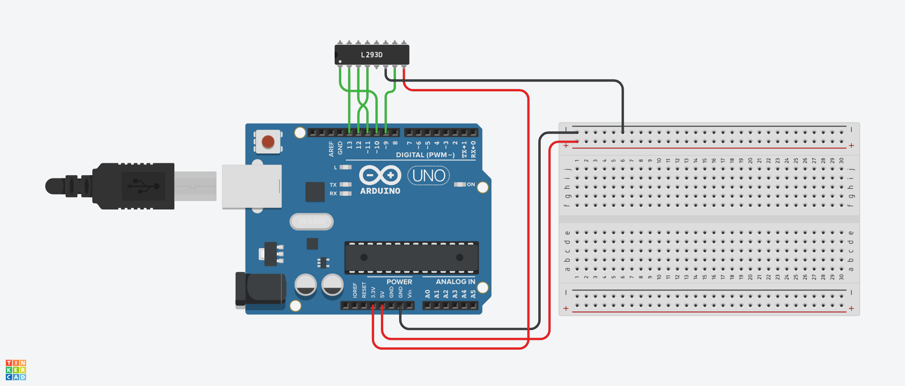
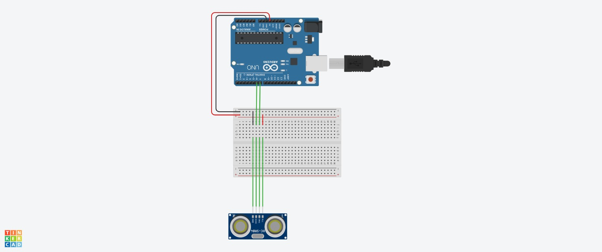
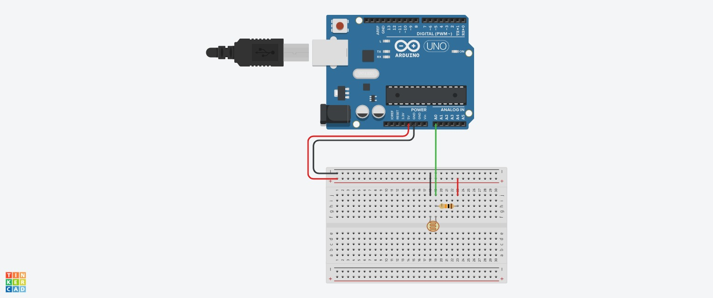

# Arduino Code
Diese Datei enthält den Code für alle für den [Arduino] relevanten Sensoren und Aktoren.

[Arduino]: https://www.arduino.cc/

## Servomotor
```cpp
#include "Servo.h"  

const int servo_min = 0;
const int servo_max = 180;

Servo Servomotor; 

void setup() {
  Servomotor.attach(3);  
}

void loop() { 
  Servomotor.write(servo_min);
}
```



## LED
```cpp
const int led_red = 7;
const int led_green = 5;
const int led_blue = 6;

void setup() {
  pinMode(led_red, OUTPUT);
  pinMode(led_green, OUTPUT);
  pinMode(led_blue, OUTPUT);
}

void loop() {
  digitalWrite(led_blue, HIGH);
  delay(1000);
  digitalWrite(led_blue, LOW);
  delay(1000);
}
```


## Taster
```cpp
const int taster = 2;

void setup() {
  pinMode(taster, INPUT);
}

void loop() {
  if (digitalRead(taster) == HIGH) {
    // Einmalige Schleife
  } else {
    // Nix
  }
}
```


## Schalter
```cpp
const int taster = 2;   
int taster_status = 0;

void setup() {
  Serial.begin(9600);  
  pinMode(taster, INPUT);  
}

void loop() {  
  if (digitalRead(taster) == HIGH) {      
    taster_status++;
    delay(200);
  }

  if (isEven(taster_status)) {
    // Wird zuerst Ausgeführt
    Serial.println("Die Schalter Zahl ist gerade.");
  } else {
    // Wird nach Taster-Druck Ausgeführt
    Serial.println("Die Schalter Zahl ist ungerade.");
  }
}

bool isEven(int num) {
  return num % 2 == 0; // Zahl gerade -> True
}
```


## RFID Toggle
```cpp
#include "MFRC522.h"

#define SDA 10
#define RST 9

MFRC522 mfrc522(SDA, RST);

void setup() {
  Serial.begin(9600);
  SPI.begin();
  mfrc522.PCD_Init();
}

void loop() {
  if (mfrc522.PICC_IsNewCardPresent() && mfrc522.PICC_ReadCardSerial()) {
    Serial.println("Karte entdeckt!");

    String WertDEZ = "";
    for (byte i = 0; i < mfrc522.uid.size; i++) {
      WertDEZ += String(mfrc522.uid.uidByte[i], DEC) + " ";
    }

    Serial.println("Dezimalwert: " + WertDEZ);

    if (WertDEZ == "153 21 213 185 ") {
      Serial.print("Code Ausführen!");
      delay(1000);
    }
    mfrc522.PICC_HaltA();
  }
}
```


## RFID ON / OFF
```cpp
#include "MFRC522.h"

#define SDA 10
#define RST 9
int rfid_status = 0;

MFRC522 mfrc522(SDA, RST);

void setup() {
  Serial.begin(9600);
  SPI.begin();
  mfrc522.PCD_Init();
}

void loop() {
  if (mfrc522.PICC_IsNewCardPresent() && mfrc522.PICC_ReadCardSerial()) {
    Serial.println("Karte entdeckt!");
    String WertDEZ = "";
    for (byte i = 0; i < mfrc522.uid.size; i++) {
      WertDEZ += String(mfrc522.uid.uidByte[i], DEC) + " ";
    }

    Serial.println("Dezimalwert: " + WertDEZ);

    if (WertDEZ == "153 21 213 185 ") {
      Serial.print("Code Ausführen!");
      rfid_status++;
      delay(1000);
    }
    mfrc522.PICC_HaltA();
  }

  if (isEven(rfid_status)) {
    // Wird zuerst Ausgeführt
    Serial.println("Die RFID Zahl ist gerade.");
  } else {
    // Wird nach Taster-Druck Ausgeführt
    Serial.println("Die RFID Zahl ist ungerade.");
  }
}

bool isEven(int num) {
  return num % 2 == 0; // Zahl gerade -> True
}
```


## Ultraschallsensor
```cpp
const int TRIG = 9;
const int ECHO = 8;
long Entfernung = 0;

void setup() {
  pinMode(TRIG, OUTPUT);
  pinMode(ECHO, INPUT);
  Serial.begin(9600);

}

void loop() {
  digitalWrite(TRIG, LOW);
  delay(5);
  digitalWrite(TRIG, HIGH);
  delayMicroseconds(10);
  digitalWrite(TRIG, LOW);
  long Zeit = pulseIn(ECHO, HIGH);
  Entfernung = (Zeit / 2) * 0.03432;
  delay(200);

  Serial.print("Entfernung in cm: ");
  Serial.println(Entfernung);
}
```


## LDR
```cpp
int LDR = A0;

void setup() {
  pinMode(LDR, INPUT);
  Serial.begin(9600);

}

void loop() {
  int SensorWert = analogRead(LDR);
 
  Serial.println(SensorWert);
  
  // constant value ~200
  // darkness value ~ 500
  // light value ~ 30
}
```


## Wichtige Funktionen
- `delay(1000);` Pausiert das Programm für 1 Sekunde.
- `Serial.begin(9600);` Startet die serielle Kommunikation mit 9600 Baud.  
- `if (WertDEZ == "153 21 213 185 " && digitalRead(led_green) == HIGH) {}` Überprüft, ob WertDEZ exakt "153 21 213 185 " entspricht und ob led_green auf HIGH steht.
